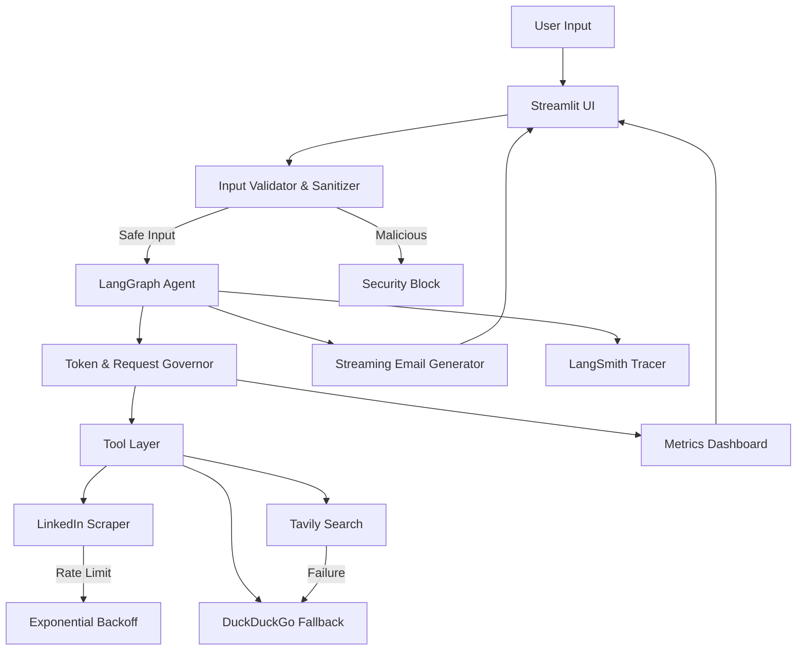
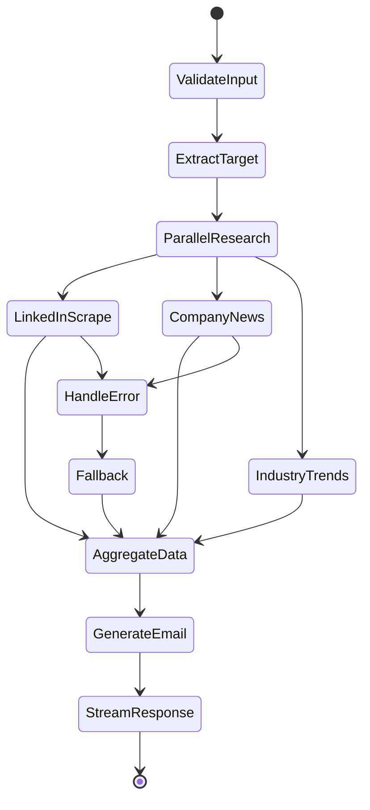

# Safe-Growth Lead Researcher - Architecture Plan

## Project Overview
An AI-powered lead research agent that takes a LinkedIn URL or company name, researches the target, finds recent news, and drafts personalized outreach emails. Built with production-grade features including rate limiting, error handling, security guardrails, and performance optimization.

## Tech Stack

### Core Framework
- **LangGraph**: State management and agent orchestration
- **Google Gemini 1.5 Flash**: Primary LLM (cost-effective, fast)
- **Python 3.11+**: Runtime environment

### APIs & Services
- **Tavily Search API**: Primary search provider
- **DuckDuckGo**: Fallback search provider
- **Custom LinkedIn Scraper**: Profile data extraction
- **LangSmith**: Execution tracing and monitoring

### Backend & Frontend
- **FastAPI**: Backend API server
- **Streamlit**: Interactive UI with real-time metrics
- **Tenacity**: Retry logic with exponential backoff

### Security & Monitoring
- **Custom Guardrails**: Prompt injection detection
- **Token Governor**: RPM/TPM tracking and rate limiting

## System Architecture



## Core Components

### 1. Input Validation & Security Layer
**File**: `src/security/guardrails.py`

- Prompt injection detection using regex patterns
- Input sanitization before LLM processing
- "Try to Break Me" testing interface
- Malicious intent classification

### 2. Token & Request Governor
**File**: `src/core/rate_limiter.py`

- Real-time RPM (Requests Per Minute) tracking
- Real-time TPM (Tokens Per Minute) tracking
- Sliding window algorithm for accurate rate limiting
- Dashboard metrics export

### 3. LinkedIn Scraper
**File**: `src/tools/linkedin_scraper.py`

- Profile data extraction (name, title, company, bio)
- Rate limiting to avoid detection
- Error handling with graceful degradation
- Caching to reduce redundant requests

### 4. Search Integration
**File**: `src/tools/search_tools.py`

- Primary: Tavily Search API
- Fallback: DuckDuckGo search
- Parallel tool calling for concurrent searches
- Automatic failover on errors

### 5. LangGraph Agent Workflow
**File**: `src/agent/workflow.py`

**State Machine**:


### 6. Retry & Error Handling
**File**: `src/core/retry_handler.py`

- Exponential backoff with jitter
- Maximum retry attempts: 3
- UI feedback: "Rate limit hit. Retrying in 4s (Attempt 2/3)..."
- Graceful degradation to secondary sources

### 7. Streaming Architecture
**File**: `src/agent/streaming.py`

- Stream email generation token-by-token
- Display "Time to First Token" (TTFT)
- Track "Total Execution Time"
- Real-time UI updates

### 8. Streamlit UI
**File**: `src/ui/app.py`

**Layout**:
- Main input area (LinkedIn URL or Company Name)
- Sidebar metrics dashboard (RPM, TPM, TTFT, Total Time)
- "Simulate Tool Failure" toggle
- "Try to Break Me" security test input
- Real-time streaming output area
- Execution trace link (LangSmith)

### 9. FastAPI Backend
**File**: `src/api/main.py`

**Endpoints**:
- `POST /research`: Main research endpoint
- `GET /metrics`: Current rate limit metrics
- `POST /validate`: Input validation endpoint
- `GET /health`: Health check

## Project Structure

```
safe-growth-researcher/
├── src/
│   ├── agent/
│   │   ├── __init__.py
│   │   ├── workflow.py          # LangGraph agent
│   │   ├── streaming.py         # Streaming logic
│   │   └── prompts.py           # System prompts
│   ├── tools/
│   │   ├── __init__.py
│   │   ├── linkedin_scraper.py  # LinkedIn scraper
│   │   ├── search_tools.py      # Tavily + DuckDuckGo
│   │   └── email_generator.py   # Email drafting
│   ├── core/
│   │   ├── __init__.py
│   │   ├── rate_limiter.py      # Token governor
│   │   ├── retry_handler.py     # Exponential backoff
│   │   └── config.py            # Configuration
│   ├── security/
│   │   ├── __init__.py
│   │   └── guardrails.py        # Input validation
│   ├── ui/
│   │   ├── __init__.py
│   │   ├── app.py               # Streamlit app
│   │   └── components.py        # UI components
│   └── api/
│       ├── __init__.py
│       └── main.py              # FastAPI server
├── tests/
│   ├── test_agent.py
│   ├── test_tools.py
│   ├── test_security.py
│   └── test_rate_limiter.py
├── .env.example
├── requirements.txt
├── README.md
├── ARCHITECTURE.md
└── docker-compose.yml
```

## Key Features Implementation

### Feature 1: Token Budgeter (Rate Limiting)
- **Dashboard Display**: Live RPM/TPM counters
- **Implementation**: Sliding window algorithm with Redis-like in-memory store
- **UI Feedback**: Visual indicators when approaching limits
- **Retry Logic**: Exponential backoff with user-visible countdown

### Feature 2: Graceful Degrader (Error Handling)
- **Simulate Failure**: Toggle to force tool failures
- **Fallback Strategy**: Tavily → DuckDuckGo → Cached results
- **User Notification**: Clear error messages with fallback status
- **Logging**: Comprehensive error tracking for debugging

### Feature 3: Streaming Architect (Latency Optimization)
- **TTFT Tracking**: Measure time to first token
- **Parallel Execution**: Concurrent tool calls for research
- **Streaming Output**: Real-time email generation display
- **Performance Metrics**: Total execution time tracking

### Feature 4: Guardrail Shield (Security)
- **Input Scanning**: Pre-LLM validation layer
- **Pattern Detection**: Regex + LLM-based classification
- **Jailbreak Response**: Standard security message
- **Test Interface**: "Try to Break Me" input box

## API Rate Limits (Tier 1)

### Google Gemini 1.5 Flash
- **RPM**: 15 requests/minute
- **TPD**: 1,500 requests/day
- **TPM**: 1,000,000 tokens/minute

### Tavily Search API
- **Free Tier**: 1,000 searches/month
- **Rate Limit**: ~33 searches/day

## Development Phases

### Phase 1: Foundation (Days 1-2)
- Project setup and dependencies
- Configuration management
- Basic LangGraph agent structure

### Phase 2: Core Tools (Days 3-4)
- LinkedIn scraper implementation
- Search tool integration
- Rate limiter and retry logic

### Phase 3: Agent Logic (Days 5-6)
- LangGraph workflow implementation
- Parallel tool calling
- Email generation with streaming

### Phase 4: Security & UI (Days 7-8)
- Guardrails implementation
- Streamlit UI with metrics
- FastAPI backend

### Phase 5: Testing & Polish (Days 9-10)
- Unit tests
- Integration tests
- Documentation
- LangSmith integration

## Success Metrics

1. **Performance**: TTFT < 2 seconds, Total time < 15 seconds
2. **Reliability**: 99% success rate with fallbacks
3. **Security**: 100% prompt injection detection
4. **Cost**: < $0.10 per research request
5. **UX**: Real-time feedback at every step

## Deployment Strategy

### Local Development
```bash
python -m venv venv
source venv/bin/activate
pip install -r requirements.txt
streamlit run src/ui/app.py
```

### Production (Docker)
```bash
docker-compose up -d
```

### Cloud Deployment
- **Option 1**: Streamlit Cloud (UI) + Railway (FastAPI)
- **Option 2**: Google Cloud Run (containerized)
- **Option 3**: AWS ECS with Application Load Balancer

## Monitoring & Observability

- **LangSmith**: Full execution traces with public links
- **Metrics Dashboard**: Real-time performance monitoring
- **Error Tracking**: Comprehensive logging with context
- **Cost Tracking**: Token usage and API call monitoring

---

**Next Steps**: Review this architecture plan, then proceed with implementation starting from Phase 1.